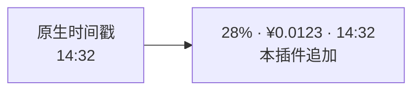
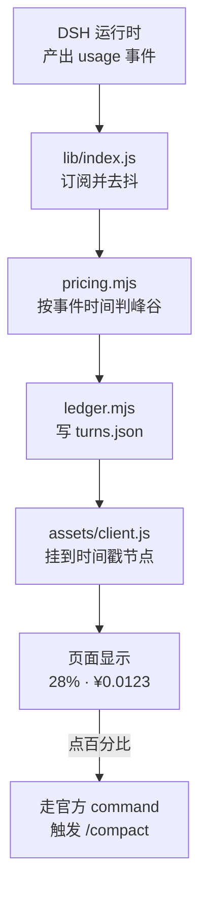

# dsh-turn-cost   

> 一句话定位：它把 DSH 里"这一轮到底花了多少钱"变成每轮回复旁的一个具体数字，给按月按量计费、想看清钱花在哪一轮的人用。


| 项 | 改造前 | 改造后 |
| --- | --- | --- |
| 单轮花费 | 看不到，只能月底看总数 | 每轮回复旁直接显示 `¥0.0123` |
| 上下文占用 | 靠感觉"是不是越聊越贵了" | 时间戳旁显示 `28%`，点一下即压缩 |
| 峰谷时段 | 分不清这轮是不是踩在高峰上 | 按官方峰谷价计费，一眼看出 |
| 历史会话 | 过去的轮次没有数据 | 用 `sessionPersistence` 回填，可回看 |
| 触发 `/compact` | 记得手打才行，常忘 | 点百分比数字即可 |
| 原生时间戳 | 正常显示 | 保持原样，本插件的内容挂在同一节点上 |

## 适合谁 / 不适合谁

- 适合：如果你要**按量/按月计费**、想知道哪一轮哪个会话最烧钱；有**长会话**想看看上下文涨到什么程度；想知道**什么时候提问更便宜**（按官方峰谷价）；或者总忘手动敲 `/compact`，想要个能点的按钮。
- 不适合：如果你用**包月订阅制**、完全不关心单轮开销；或者你的模型不是 DeepSeek 系、也不打算打开"未知模型也计价"开关（默认对非 DeepSeek 模型**不计价**，会显示为 0）——建议直接用服务商后台的用量报表。
- 本插件**不做**：不做预算限制或拦截（它只显示，不阻止你花钱）；不做官方账单对账（是**按 token × 价目表估算**）；不修改 DSH 原生时间戳的显示逻辑；不替你决定何时压缩上下文。

## 安装

### 前置条件

| 项目 | 要求 | 说明 |
| --- | --- | --- |
| Node.js | **≥ 18** | DSH 自身的运行要求 |
| pnpm | 较新版本即可 | `dsh plugin` 的剩余参数会**原样转发给 pnpm**；缺它先 `npm i -g pnpm` |
| DSH | 已安装 `@deepseek-ai/dsh`，且能跑起 `dsh web` | 本插件的宿主。DSH（DeepSeek Harness）是一个**跑在你自己电脑上**的 AI 工作台，自带网页界面，可用插件扩展 |
| 模型 | DeepSeek 系（provider 或模型名含 `deepseek`） | 默认只对 DeepSeek 系计价；其他模型显示为 `¥0.0000` |
| 操作系统 | Windows / macOS / Linux | 插件无平台特有代码 |

### 该选哪种方式

| 方式 | 适用场景 | 代价 |
| --- | --- | --- |
| GitHub 直装 | 只想用，不改代码 | 更新可能滞后 |
| `link:` 本地开发 | 调试 / 改源码 / 提 PR | 需 Node + 构建环境 |
| Download ZIP | 离线 / 锁版本 | 不自动更新 |

<details><summary>方式一：GitHub 直装（推荐，完整步骤）</summary>

```bash
dsh plugin --profile web add github:xinshang777/dsh-turn-cost
```

安装成功后 `dsh plugin` 会把包登记进 profile 的 `dsh.profile.bundles`，**不需要手动改配置**。

</details>

<details><summary>方式二：link: 本地开发（改源码 / 提 PR 走这条）</summary>

```bash
git clone https://github.com/xinshang777/dsh-turn-cost.git
cd dsh-turn-cost
dsh plugin --profile web add link:.
```

改完 `lib/*` 或 `assets/client.js` 后重启 `dsh web` 即生效。要改默认配置，编辑 `~/.dsh/profiles/web/cordis.patch.yml`（配置项表见[使用教程](#使用教程)）。

</details>

<details><summary>方式三：Download ZIP（离线 / 锁版本）</summary>

1. 打开仓库页面 → **Code → Download ZIP**，解压到任意目录；
2. 在该目录执行 `dsh plugin --profile web add link:.`；
3. 重启 `dsh web`。

⚠️ 此方式不会自动更新，升级要重新下载。

</details>

### 重启说明

| 场景 | 是否需要重启 |
| --- | --- |
| 新装 / 卸载本插件 | ✅ 必须完整重启 `dsh web` |
| 改 `~/.dsh/profiles/web/cordis.patch.yml` 里的 `config` | ✅ 需要 |
| 改 `link:` 安装的插件源码（`lib/`） | ✅ 需要 |
| 改 `assets/client.js`（前端） | ❌ 不需要重启，硬刷新 `Ctrl + F5` 即可 |
| 只是聊天、切会话、点百分比压缩 | ❌ 不需要 |
| 浏览器里看不到金额 | 先 **硬刷新**（`Ctrl + F5`） |

> 💡 装了 [dsh-restart-button](https://github.com/xinshang777/dsh-restart-button) 的话，点界面上的重启按钮一步到位，不用回命令行。

### 三十秒验证成功

打开 `dsh web` → 随便问一句 → 看到**回复下方的时间戳旁边出现 `¥0.xxxx`** = 装好了（最后一轮常显，其余轮次鼠标移上去才显示）。



如果没看到金额，按顺序查三步：① `~/.dsh/profiles/web/package.json` 的 `dsh.profile.bundles` 数组里有没有 `dsh-turn-cost`；② 是否**完整重启**了 `dsh web`；③ 该轮模型是不是 DeepSeek 系（非 DeepSeek 默认不计价）。

## 使用教程

1. **看费用** —— 装完重启、刷新页面，随便问一句，回复下方时间戳旁就会多出金额。
2. **明白"什么时候才可见"** —— 金额与原生时间戳**共享同一套显隐规则**（这是刻意对齐 DSH 上游的交互，不是 bug）：

   | 位置 | 显示时机 |
   | --- | --- |
   | 时间线**最后一轮** | 常显 |
   | **其余轮次** | 鼠标移到那一轮上时才显示 |

   如果你希望**所有轮次都常显**，可以自行注入一行 CSS：

   ```css
   [data-actions-reveal=hover]:has([data-dsh-turn-cost]) .xzv4MW_actions { opacity: 1 }
   ```

   代价是该轮**所有操作按钮也一起常显**，与 DSH 默认行为不一致，所以本插件默认不做。

3. **点上下文百分比压缩上下文** —— 点击 `28%` 那个数字，插件走**官方 command 路径**触发 `/compact`，等价于你手打 `/compact`；超时默认 120 秒。
4. **历史会话也能看到金额** —— 插件用 DSH 的 `sessionPersistence` 回填历史会话，切回旧会话时之前的轮次也会显示金额（按**事件自身发生的时间**判定峰谷）。
5. **（可选）调配置** —— 编辑 `~/.dsh/profiles/web/cordis.patch.yml`，在 `dsh-turn-cost` 的 `config:` 下调整。



**配置项**

配置写在 `~/.dsh/profiles/web/cordis.patch.yml` 的 `dsh-turn-cost: config:` 下。注意**是整体替换**：只写几个字段就只生效这几个，其余回落到下表默认值。

| 名称 | 类型 | 默认值 | 是否必填 | 作用 |
| --- | --- | --- | --- | --- |
| `currency` | string | `"¥"` | 否 | 货币符号 |
| `decimals` | number \| null | `null` | 否 | 小数位；`null` = 自适应（≥1 显示 2 位 / ≥0.01 显示 3 位 / 其余 4 位） |
| `tinyLabel` | string | `"¥<0.0001"` | 否 | 四位小数仍为 0 时的替代文案 |
| `showContext` | boolean | `true` | 否 | 在金额前显示该轮结束时的上下文占用百分比，点击可压缩 |
| `compactTimeoutMs` | number | `120000` | 否 | 触发 `/compact` 的超时（毫秒） |
| `pollMs` | number | `1200` | 否 | 页面可见时的轮询间隔（毫秒） |
| `pollMsHidden` | number | `6000` | 否 | 页面隐藏时的轮询间隔（毫秒） |
| `priceUnknownProviders` | boolean | `false` | 否 | 非 DeepSeek provider 是否仍按 `_default` 计价 |
| `includeCacheWrite` | boolean | `false` | 否 | 是否把 `cacheWriteTokens` 按未命中价计入 |
| `backfill` | boolean | `true` | 否 | 是否用 `sessionPersistence` 回填历史会话 |
| `maxReplayEvents` | number | `50000` | 否 | 单个会话回填的事件上限 |
| `ttlDays` | number | `30` | 否 | 账本数据保留天数 |
| `maxSessions` | number | `200` | 否 | 最多保留多少个会话 |
| `maxTurnsPerSession` | number | `2000` | 否 | 单会话最多保留多少轮 |
| `maxBytes` | number | `4194304` | 否 | 账本文件字节上限（4 MB） |
| `debounceMs` | number | `400` | 否 | 落盘去抖（毫秒） |

## 常见问题 / 排障

**1｜金额一直是 `¥0.0000`**

- **原因**：两种可能——① 该轮**模型不是 DeepSeek 系**（默认只对 provider 或模型名含 `deepseek` 的计价）；② 该轮没有 `usage` 数据。
- **处理**：确认你用的是 DeepSeek 系模型；如果你确实想给第三方模型也计价，在 profile 配置里把 `priceUnknownProviders` 设为 `true`（估价口径会回落到 `_default` 价目表，仅作参考）。

**2｜非最后一轮看不到金额**

- **原因**：**预期行为**。金额与原生时间戳共享显隐规则——只有最后一轮常显，其余轮次 hover 才显示，这是对齐 DSH 上游交互的刻意设计。
- **处理**：鼠标移到那一轮上即可看到；想全部常显，用上面[使用教程](#使用教程)里那行 CSS（代价是该轮所有操作按钮一起常显）。

**3｜金额和官方账单对不上**

- **原因**：本插件是**按 token × 价目表估算**，且价目表**复制**自 `dsh-whale-widget@0.3.15`（该插件没有导出这些常量）。官方调价、改峰谷规则、或你走的是不同折扣档，都会产生偏差。
- **处理**：**以官方账单为准**，本插件的数值用于"看趋势、找异常"，不适合当成精确账目。若怀疑价目表过期，比对 `lib/pricing.mjs` 顶部的 `PEAK_HOURS / BASE_PRICE / PRO_PRICE / HOLIDAY_VALLEY`。

<details><summary>完整排障表</summary>

| 现象 | 处理 |
| --- | --- |
| 非最后一轮看不到金额 | 预期行为：非末轮 hover 才显示。想常显见使用教程里的 CSS 片段。 |
| 金额一直是 `¥0.0000` | ① 该轮模型不是 DeepSeek 系（默认不计价）；② 该轮没有 usage 数据。 |
| 金额和官方账单对不上 | 按 token × 价目表估算，价目表复制自 whale。以官方账单为准。 |
| 点百分比没反应 | `/compact` 需要当前会话支持该命令；超时默认 120 秒。先确认手动敲 `/compact` 正常。 |
| 历史会话金额显示为零 | 历史数据依赖 DSH 持久化记录；超出 `ttlDays` / `maxSessions` 上限的旧数据会被回收。 |
| 页面卡顿 | 会话数多时调小 `maxTurnsPerSession` / `maxBytes`，或调大 `pollMs`。 |
| 配置改了没生效 | profile 的 `config` 是**整体替换**，且改完需重启 `dsh web`。确认字段名拼写无错。 |
| 重启后金额都不见了 | 检查 `~/.dsh/dsh-turn-cost/turns.json` 是否存在；被误删时只能靠 `backfill` 从 DSH 持久化记录重建。 |

</details>

## 兼容性与已知限制

- **宿主最低版本**：Node.js **≥ 18**；需要能跑起 `dsh web` 的 DSH（用到 `sessionProjections` / `sessionPersistence` / `webServer` 等接口）。
- **平台差异**：无。Windows / macOS / Linux 行为一致。
- **冲突插件**：与 [dsh-per-turn-isolation](https://github.com/xinshang777/dsh-per-turn-isolation) 可同开，二者关注点不同（一个改上下文、一个算钱）；但注意 `percent` 的语义会随上下文被压缩而变化，属正常现象。与各类 UI 注入插件共享同一插槽时，显示顺序由加载顺序决定。
- **已知限制**：价目表是**静态复制**而非 import，官方调价后需手动更新；`HOLIDAY_VALLEY` 只内置了 2026 年节假日表，**每年国务院发布次年安排后需要补齐下一年**；所有数值均为估算，不是官方账单。

## 升级、卸载与数据

- **配置存放位置**：
  - 配置：`~/.dsh/profiles/web/cordis.patch.yml`（profile 层，优先级高于插件自带的 bundle 层 `cordis.patch.yml`）；
  - 数据：`~/.dsh/dsh-turn-cost/turns.json`（账本，受 `ttlDays` / `maxSessions` / `maxTurnsPerSession` / `maxBytes` 四项上限约束）。
- **升级**：
  - `github:` 方式：重跑一次 `dsh plugin --profile web add github:xinshang777/dsh-turn-cost`；
  - `link:` 方式：`git pull` 后重启 `dsh web`；
  - 升级后建议比对 `lib/pricing.mjs` 的价目表是否与 `dsh-whale-widget` 最新版一致。
- **干净卸载**：
  ```bash
  dsh plugin --profile web remove dsh-turn-cost
  ```
  然后（可选）删除数据目录 `~/.dsh/dsh-turn-cost/`。插件不写注册表、不写系统目录。
- **回滚**：`link:` 方式 `git checkout <上一个 tag 或 commit>` 后重启；`github:` 方式换成旧 tag 重装。账本文件与版本解耦，回滚不会导致数据丢失（但新版本写入的字段可能不被旧版本识别）。

## 隐私

- **数据是否出本机**：**不出**。计费所需的 usage 数据由 DSH 运行时在本地提供，插件自己不抓取、不上传任何内容。
- **是否联网**：插件**自身不发起外部请求**。所有 HTTP 接口都是**回环（loopback）+ 同源（Origin）+ cookie 鉴权**护栏下的本地接口，避免被跨站页面或 DNS 重绑定利用。
- **是否读取账号**：**不读**。它不碰账号、不读客户端登录态，只读写 `~/.dsh/dsh-turn-cost/turns.json`。
- **需要知情的一点**：点击上下文百分比会走**官方 command 路径触发 `/compact`**，那一次压缩请求由 DSH 自身发起并计费——这不是本插件在联网，但会真实产生一次模型调用。

## 实现原理（贡献者向）

<details><summary>挂钩点 · 数据流 · 接口表 · 目录结构</summary>

**挂钩点：DSH 的 usage 投影与持久化**

DSH 运行时会通过 `sessionProjections` / `sessionPersistence` 暴露每一轮 assistant 消息的
**usage**（`inputTokens` / `outputTokens` / `cacheReadTokens` / `cacheWriteTokens`）与**模型 / provider**。
插件订阅这些事件逐条算费用；页面隐藏时降低轮询频率（`pollMsHidden`）省资源。

**计价口径**

对齐 `dsh-whale-widget@0.3.15`（独立实现，不依赖该插件安装）。单位是**元 / 百万 token**，高峰价为空闲价的 **2 倍**：

| 模型 | 缓存命中（hit） | 未命中输入（miss） | 输出（out） |
| --- | --- | --- | --- |
| `deepseek-flash` | 0.02 / 0.04 | 1 / 2 | 4 / 8 |
| `deepseek-v4-pro` | 0.15 / 0.3 | 4.5 / 9 | 13.5 / 27 |

*（每格为 空闲价 / 高峰价）*

**峰谷判定**：高峰 = 北京时间周一至周五 `09:00–12:00`、`14:00–18:00`（不含法定节假日）；其余为谷时（含周末、法定节假日、工作日高峰之外）。

```
费用 = 缓存命中token/1e6 × hit价
     + 未命中输入token/1e6 × miss价
     + 输出token/1e6 × out价
```

几条容易踩的口径：`reasoningTokens` **包含在** `outputTokens` 里不重复累加；`cacheWriteTokens` **默认不计费**（可用 `includeCacheWrite` 打开）；**只对 DeepSeek 系模型计价**。

与 whale 的一处**有意偏差**：whale 用 `Date.now()` 判峰谷，本插件用**事件自身的时间**——实时场景差异可忽略，但历史回填必须如此才准确、可复现。

**接口表**

| 方法 | 路径 | 用途 |
| --- | --- | --- |
| `GET` | `/dsh-turn-cost/turns` | 拉取账本数据（供前端显示） |
| `POST` | `/dsh-turn-cost/compact` | 走官方 command 路径触发 `/compact` |
| `GET` | `/dsh-turn-cost/client` | 提供前端脚本 |

**显示挂在哪**

通过 `@deepseek-ai/dsh-client-ui-conversation` 的插槽，把节点**挂到该轮已存在的时间戳节点上**（而不是自己新建一行），因此天然继承时间戳的显隐规则、对齐方式与主题变量；会话归属以官方 `data-conversation-session` 为准，切换或新建会话不会串数据。

**数据流**

```
DSH usage 事件
  └─ lib/index.js 订阅（页面隐藏时降频）
       ├─ pricing.mjs  按事件时间判峰谷 → 单条费用
       └─ ledger.mjs   去抖落盘 turns.json
            └─ assets/client.js 挂到时间戳 → 页面显示
                                    └─ 点百分比 → POST /dsh-turn-cost/compact
```

**目录结构**

```text
dsh-turn-cost/
├── lib/
│   ├── index.js       # 宿主侧：订阅 usage 事件、HTTP 接口、轮询与落盘调度
│   ├── pricing.mjs    # 计价：峰谷判定 + 模型价目表 + 单条费用
│   ├── money.mjs      # 金额格式化（自适应小数位 / 极小值文案）
│   ├── ledger.mjs     # 账本：turns.json 读写、TTL / 条数 / 字节上限、去抖落盘
│   └── backfill.mjs   # 历史会话回填
├── assets/client.js   # 浏览器侧：把节点挂到时间戳上、点击触发 /compact
├── cordis.patch.yml   # bundle 挂载声明 + 默认配置
└── package.json
```

</details>

详见 `docs/architecture.md`

## 贡献与反馈

[CONTRIBUTING.md](CONTRIBUTING.md) · [CHANGELOG.md](CHANGELOG.md) · Issue 模板

改价目表时请一并更新 `lib/pricing.mjs` 顶部的常量与本节表格，避免文档与实现脱节。

## 许可证

MIT — 见 [LICENSE](LICENSE)
